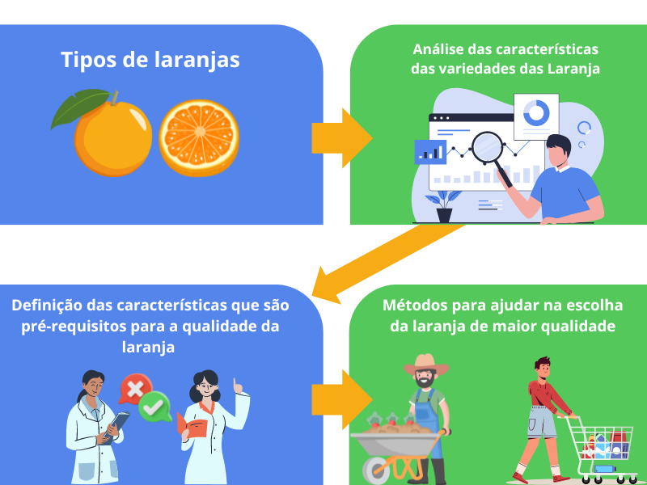

# Citrus  Squad

A laranja é um alimento rico em vitamina C e é um dos principais alimentos na mesa do brasileiro, assim é necessário que o produtor e o consumidor saibam fazer análises que possam facilitar na colheita e na escolha da fruta. A precisão na classificação das laranjas é fundamental para garantir a qualidade dos produtos alimentícios. Este projeto visa desenvolver uma aplicação que utilize um conjunto de características das laranjas, como acidez e maturidade, para fornecer uma classificação precisa. Utilizando técnicas de análise de dados e machine learning, nosso objetivo é oferecer uma solução eficaz e de baixo custo tanto para o produtor quanto para o consumidor final das laranjas, contribuindo para a melhoria dos processos de seleção e classificação.

## Desenvolvedores
 - [Rafael Santos] https://github.com/RafaelSantos84
 - [Lucas Cardoso] https://github.com/LCarlosA
 - [Eduardo Teles] https://github.com/eduardw07
